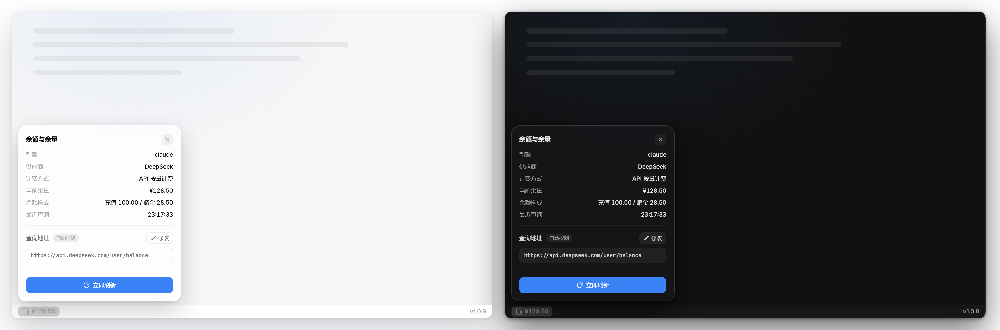
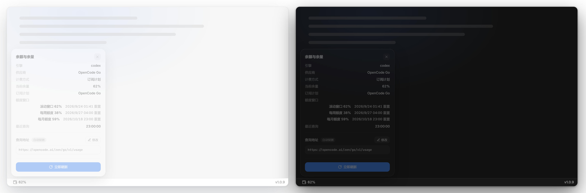
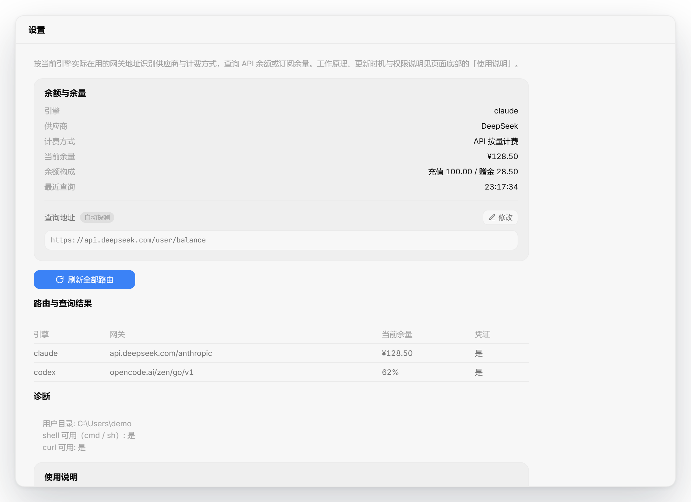

# balance-meter（余额与余量）

CC GUI 插件：**按当前引擎实际在用的网关地址识别供应商与计费方式**，再查询对应的余额或订阅余量。

- **API 计费**的供应商 → 查余额（如 DeepSeek `GET /user/balance`）
- **订阅计划** → 查订阅/配额余量
- 供应商没有公开接口 → 明确显示「暂时无法提供余额显示」，不猜数字

## 安装

CC GUI → 设置 → 插件 → 插件市场 → 安装；或从本地目录安装（见下方「开发」）。

## 界面预览

状态栏面板：按当前路由显示 API 余额或订阅余量（左浅色 / 右深色）。



订阅渠道按窗口展示额度（滚动 / 每周 / 每月）。



设置页：当前路由详情、查询地址（可手工修改）、路由清单与诊断。



> 以上为界面示意，数字为示例数据。

## 它显示什么

- **状态栏 chip**：当前路由的余额/余量（查不到时显示「无法查询」），点开是详情面板
- **详情面板**：引擎 / 供应商 / 计费方式 / 当前余量 / 查询地址 / 最近查询时间，以及「立即刷新」
- **设置页**：同上面板 + 查询地址可手工修改 + 路由清单与诊断

## 什么时候会更新

| 时机 | 行为 |
|---|---|
| 打开 CC GUI | 对准上次使用的引擎（或宿主回放的当前会话），立即查询一次 |
| 切换标签 / 选择会话 | 切到该引擎的路由，重新查询 |
| 每轮对话结束 | 自动刷新一次（两次刷新之间至少间隔 30 秒） |
| 手动 | 状态栏面板「立即刷新」、设置页「刷新全部路由」、命令面板「刷新余额与余量」 |

查询成功的接口会**按路由（域名 + 路径）缓存**，下次直接命中；缓存地址失效时自动重新探测，
全部失败后 10 分钟内不再重复请求（手动刷新可强制重探）。

## 工作方式

1. **识别路由**：读 `~/.ccgui-next/config.json` 的 `providers` / `current`；`current` 为
   `__local_settings_json__` 时改读该引擎自己的配置（claude → `~/.claude/settings.json` 的
   `ANTHROPIC_BASE_URL`；codex → `~/.codex/config.toml` 与登录状态）。Codex 使用 ChatGPT
   账号登录且没有自定义 `base_url` 时，调用官方 `codex app-server` 的
   `account/rateLimits/read` 获取订阅额度窗口；Claude Code 使用订阅账号（OAuth）登录且没有
   自定义网关与 API key 时，读 `~/.claude/.credentials.json` 并查询内部用量接口
   `api/oauth/usage`（5 小时 / 7 天窗口；实验性，令牌过期只提示重新登录、不代为刷新）。
2. **判断供应商**：网关命中已知编程套餐渠道（Kimi Coding / 智谱 GLM·Z.AI / MiniMax）
   时直接走各自的套餐额度接口（见下表）；否则按网关主机名匹配内置供应商目录，未命中则按
   New-API / One-API 系中转的常见余量接口逐个探测。
3. **查询与缓存**：命中即按路由缓存该接口地址，下次直接使用；地址失效会自动重探。

## 收录的供应商（与 ccgui 自定义渠道预设表对齐）

**没有公开余额接口的也一律收录**，这样提示是「XX 未提供公开的余额/余量查询接口」，
而不是含糊的「未知供应商」。

| 供应商 | 网关域名 | 计费 | 余额/余量接口 |
|---|---|---|---|
| DeepSeek | api.deepseek.com | API | ✅ `GET /user/balance` |
| OpenRouter | openrouter.ai | API | ✅ `GET /api/v1/credits` |
| Moonshot / Kimi | api.moonshot.cn / .ai | API | ✅ `GET /v1/users/me/balance` |
| SiliconFlow | *.siliconflow.cn / .com | API | ✅ `GET /v1/user/info` |
| OpenAI（官方直连） | api.openai.com | API | ⚠️ `GET /v1/dashboard/billing/subscription`（现多为会话 key 专用） |
| 智谱 GLM / Z.AI 编码套餐 | open.bigmodel.cn · api.z.ai | 订阅 | ✅ `GET /api/monitor/usage/quota/limit`（5 小时 / 每周；**已用真实套餐实测**） |
| Z.AI 编码套餐 | api.z.ai | 订阅 | ❌ 无公开接口 |
| Kimi Coding | api.kimi.com | 订阅 | ✅ `GET /coding/v1/usages`（5 小时 / 每周；API key 或 Kimi Code CLI 登录） |
| MiniMax 编程套餐 | api.minimaxi.com · api.minimax.io | 订阅 | ✅ `GET /v1/api/openplatform/coding_plan/remains`（5 小时 / 每周） |
| Xiaomi MiMo | api.xiaomimimo.com | API | ❌ 无公开接口 |
| Xiaomi MiMo Token Plan | token-plan-{cn,ams,sgp}.xiaomimimo.com | 订阅 | ❌ 无公开接口 |
| 阿里云百炼 Bailian | *.dashscope.aliyuncs.com | API | ❌ 仅控制台可见 |
| LongCat | api.longcat.chat | API | ❌ 无公开接口 |
| OpenCode Go | opencode.ai/zen/go | 订阅 | ✅ `GET /zen/go/v1/usage`（滚动/周/月窗口） |
| Anthropic 官方 | api.anthropic.com | API | ❌ 无公开接口 |
| OpenAI 订阅 | chatgpt.com | 订阅 | ✅ Codex App Server `account/rateLimits/read` |
| Claude 订阅 | api.anthropic.com（OAuth 登录） | 订阅 | ⚠️ 内部接口 `GET /api/oauth/usage`（实验性，未真机验证） |
| Grok 订阅（Grok CLI 登录） | cli-chat-proxy.grok.com | 订阅 | ✅ `GET /v1/billing?format=credits`（信用池周期） |
| xAI Grok | api.x.ai | API | ❌ 无公开接口 |
| Groq / Mistral / Together / Google Gemini | api.groq.com · api.mistral.ai · api.together.xyz · generativelanguage.googleapis.com | API | ❌ 无公开接口 |
| 未识别的中转站 | 任意其它域名 | 由返回值推断 | 依次探测 New-API `/api/user/self`、OpenAI 兼容 billing、`/api/v1/credits`、`/api/user/subscription`、`/api/usage` |

> `❌` 的判定依据：对这些域名做过无密钥 GET 探测，常见余额路径均为 404（个别站点任何路径都回
> 200，则由响应结构解析拦截）。若某家后来上线了接口，在设置里把路径填进「自定义余量接口」即可，
> 支持 `{base}` / `{origin}` 占位符，无需改代码。

## 权限说明（重要）

插件声明了 `exec:curl`，以及 `exec:cmd` / `exec:powershell.exe`（Windows）、
`exec:sh`（macOS、Linux）：

1. 宿主的网络出口（`plugin_http_request`）要求**预先声明具体域名**，而"按实际路由识别中转站"
   本质上无法预知域名，所以必须走 exec 出口；
2. `cmd` / `sh` 仅用于取用户目录（`echo %USERPROFILE%` / `printf %s "$HOME"`）；
3. `curl` 用于读 `~/.ccgui-next/config.json` 与各引擎配置（含 `~/.claude/.credentials.json`、
   `~/.kimi-code/credentials/kimi-code.json`、`~/.grok/auth.json`），以及向**该路由自己的供应商**
   发起只读查询；
4. Codex 官方 ChatGPT 登录模式由 PowerShell / sh 向本机 `codex app-server` 写入官方 JSON-RPC
   请求来查询额度；查询过程不把登录 Token 放进命令行，也不自行向远端传递 Token。Claude 订阅
   令牌只作为 curl 鉴权头发送给 Anthropic 自己的用量接口，不写日志、不入插件存储；
5. **不读取宿主内部状态**：当前引擎只来自官方事件（`session://activated` 与 usage 载荷里的
   `engine`）；密钥只用于上述只读查询，不落盘、不入日志、不外发第三方。

## 适用平台

| 平台 | 状态 | 说明 |
|---|---|---|
| **Windows** | ✅ 已实测 | 用 `cmd /d /c echo %USERPROFILE%` 定位家目录；家目录为 `C:\Users\x` 时路径沿用 `\`（读取时转成 `file:///C:/…`）。其中**智谱 GLM 套餐通道已用真实套餐（Lite）端到端验证**；Claude 订阅、Kimi、MiniMax、Grok 四条通道目前仅单测与夹具覆盖。 |
| **macOS / Linux** | ⚠️ 已适配，尚未真机验证 | 改用 `sh -c 'printf %s "$HOME"'`、路径用 `/`；curl 参数本身跨平台通用。 |

平台判断读 webview 的 `navigator.userAgentData.platform` / `navigator.userAgent`，判不出来时按
已实测的 Windows 分支走。样式侧 `backdrop-filter` 带 `-webkit-` 前缀（macOS WKWebView 需要），
Linux WebKitGTK 若不支持毛玻璃会退化为半透明底，均不影响功能。

> **宿主版本**：启动瞬间就认对引擎依赖 `session://activated` 的粘性回放
> （上游 [PR #1254](https://github.com/zhukunpenglinyutong/desktop-cc-gui/pull/1254)）。
> 更早的宿主首帧会显示「未确认」，切一次标签或发一条消息后自动纠正。

## 已知边界

- Anthropic Pro / Max 没有公开余量接口；Codex 的 ChatGPT 登录模式可通过官方 App Server
  显示主、次两个额度窗口。若本机 `codex` 版本过旧或命令不在 PATH，查询会失败并显示原因。
- 中转站的余量接口差异极大：探测失败的可在设置里用「自定义余量接口」手工指定。

## 开发

```bash
pnpm install
pnpm typecheck && pnpm test          # 单测：路由 / 供应商 / 缓存 / 编辑态 / 跨平台分支
pnpm build                           # 产物默认输出到仓库内 dist/，可用 CCGUI_PLUGIN_OUT_DIR 覆盖
pnpm validate && pnpm validate:dist  # 本地预检，镜像市场 CI 的门槛
```

本地调试：CC GUI → 设置 → 插件 → 从本地目录安装 → 选产物目录；改完重新 build 再装一次即可
（宿主安装的是拷贝快照并立即热加载，无需重启）。

发版：改 `manifest.json` 的 `version` → `git tag <version> && git push origin <version>`；
仓库自带的 GitHub Action 会构建并把 `main.js` / `manifest.json` / `checksums.txt` 附到 Release。

展示素材：`docs/icon.png` 与 `docs/screenshot-*.png` 由 manifest 的 `icon` / `screenshots`
声明，市场按仓库**默认分支**读取（替换同名文件不需要发版，改路径要随下次发版登记）；
图标源文件是 `docs/icon.svg`。

## 实现备注（给插件作者）

1. **样式要走 `ctx.theme.injectCss`**（源码用 `src/ui.css` + 构建时 `?inline`），不要产出
   `styles.css`：宿主对 `styles.css` 的自动注入会包进最低优先级的 `@layer ccgui-plugins`，
   而 Tailwind preflight 在更高的 `base` 层里写着 `button{background-color:transparent;
   border-radius:0}` 与 `*{padding:0;border:0 solid}`，会把按钮底色、圆角、内边距、边框整片
   盖掉（层序优先于选择器特异性）。
2. **当前引擎只来自官方事件**（`session://activated`、usage 载荷的 `engine`），不读宿主内部
   状态；引擎已确认时只认该引擎的路由，找不到就明说「未识别到该引擎的路由配置」，
   绝不跨引擎回退到别人的数据。

## License

MIT，见 [LICENSE](LICENSE)。
